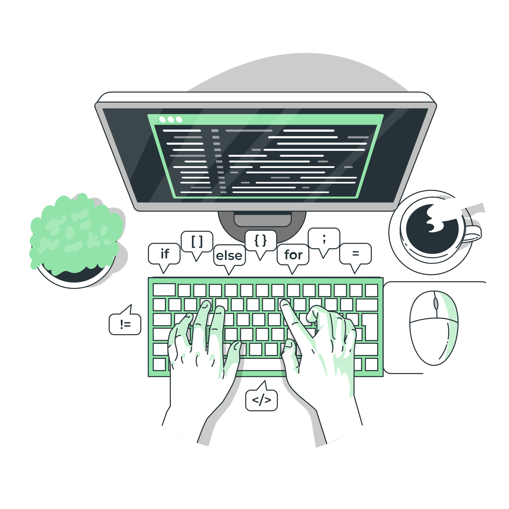

<h1>
    Érika Moreno
</h1>

Analista de Testes, pós graduanda em Engenharia de Software. Participei da turma da 7ª geração do  Bootcamp da Laboratoria Brasil e tive contato com HTML, CSS e JavaScript e foi através do Hackaton de Empregabilidade que fui contrata para trabalhar como QA. Atualmente trabalho como QA Engineer.
 
.

### Entre em contato comigo

### GitHub Stats

